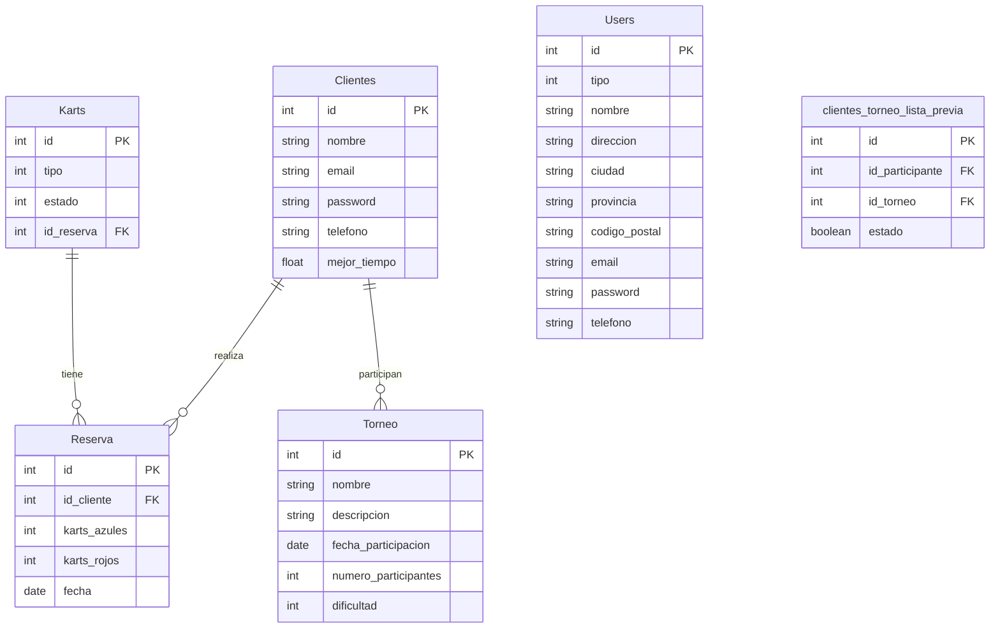

# Deseño

## Diagrama da arquitectura

## Diagrama de Base de Datos

```mermaid
erDiagram
    
    Clientes ||--o{ Reserva : realiza
    Karts ||--o{ Reserva : tiene
    Clientes ||--o{ Torneo : participan

    Clientes {
        int id PK
        string nombre
        string email
        string password
        string telefono
        float mejor_tiempo
    }

    Users {
        int id PK
        int tipo
        string nombre
        string direccion
        string ciudad
        string provincia
        string codigo_postal
        string email
        string password
        string telefono
    }

    Karts {
        int id PK
        int tipo
        int estado
        int id_reserva FK
    }

    Reserva {
        int id PK
        int id_cliente FK
        int karts_azules
        int karts_rojos
        date fecha
    }

    Torneo {
        int id PK
        string nombre
        string descripcion
        date fecha_participacion
        int numero_participantes
        int dificultad
    }

    clientes_torneo_lista_previa {
        int id PK
        int id_participante FK
        int id_torneo FK
        boolean estado
    }
```
## Deseño de interface de usuarios
