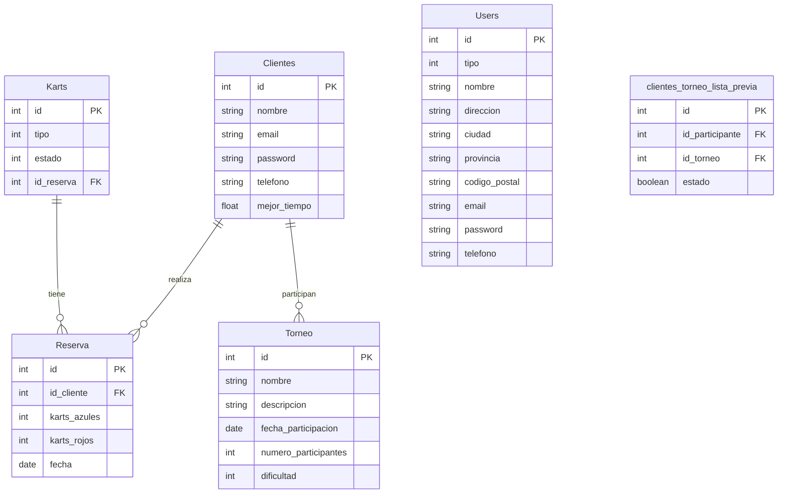

# Deseño

## Diagrama da arquitectura

## Diagrama de Base de Datos

## Deseño de interface de usuarios
Los siguientes mock ups son para mostrar unha idea de como seria a estrutura base de aplicación

- Mock up das tablas nas vistas do administrador

- Mock up da vista para alistarse nun torneo

- mock up vista de formularios

A posible paleta de colores que se implementara seguira el siguiente modelo

